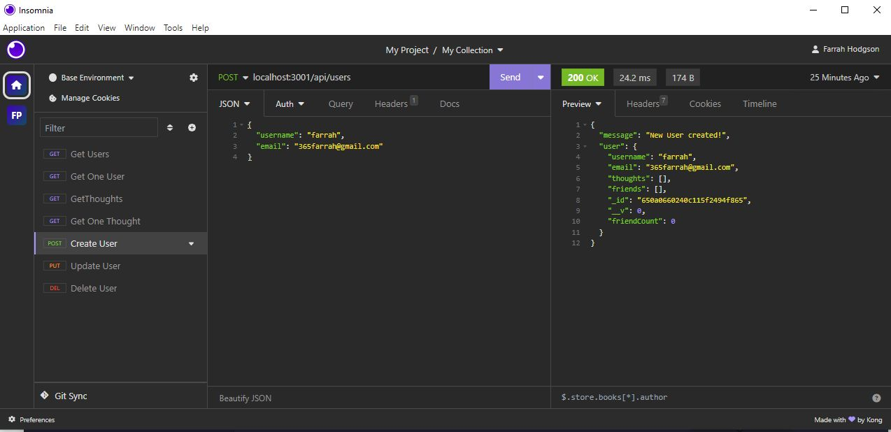

# Serving-a-Social-Network

## Description

This application is a back end for a a social network API that uses a NoSQL database so that a website can handle large amounts of unstructured data. Users can share their thoughts, react to friends' thoughts, and create a friend list.

## Table of Contents

- [Installation](#installation)
- [Usage](#usage)
- [Video](#video)
- [Screenshots](#Screenshots)
- [Credits](#credits)
- [Tests](#tests)
- [License](#license)

## Installation

Clone the repository: **git clone https://github.com/Firene11/Serving-a-Social-Network.git**

## Usage

From the command line in your terminal run the commmand:

**npm run seed** to seed the database

A development database is created and is seeded with test data.

From the command line in your terminal run the commmand:

**npm start** to listen to the PORT

The server is started and the Mongoose models are synced to the MongoDB database.

When you open API GET routes in Insomnia for users and thoughts, the data for each of these routes is displayed in a formatted JSON.

When you test API POST, PUT, and DELETE routes in Insomnia, you are able to successfully create, update, and delete users and thoughts in the MongoDB database.

When you test API POST and DELETE routes in Insomnia, you are able to successfully create and delete reactions to thoughts and add and remove friends to a user’s friend list.

## Video

**Watch this VIDEO to see how the app runs!**

https://drive.google.com......

## Screenshots

## Credits

Juno Nguyen (tutor)

## Tests

**https://insomnia.rest/**
